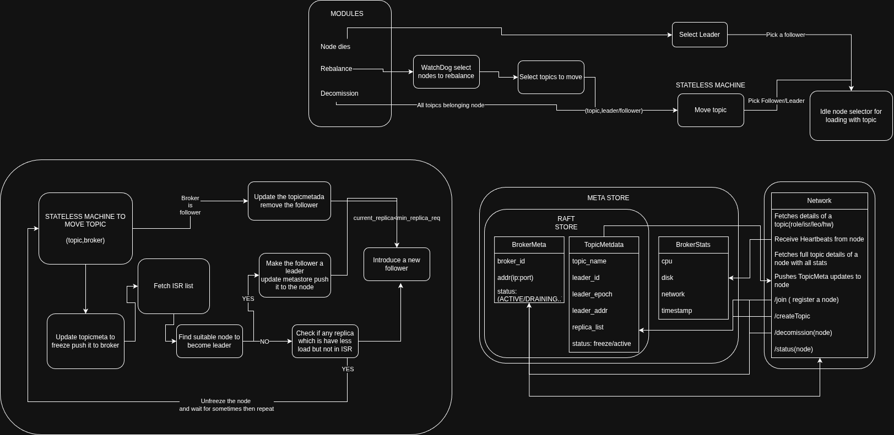

# Controller Design

## Overview

##### The three core modules:-
- metastore
- network
- rebalance

## The Required Guarentees by broker
- Broker must validates it log offset
    - When it running it should store last
    seen high_watermark.
    - When it's reboot it must retreive that last commit high_watermark and delete all offset greater then high_watermark
    - If It don't have last seen high_watermark. It most purge it's log of that topic.
- HeartBeat
    - Broker must send heartbeat every (1-5) seconds.
    - Heartbeat should include node stats like(cpu, disk, network...)
    - Failure to send the heartbeat will implies as the death of the node.

## MetaStore
Meta store is the storage layer of the controller it will later include quorum (raft).

Two parts of the storage:-
- Backed by replication(raft)
- Doesn't backed by replicated (in-memory)

#### Replication backed storage
It will provide method as ***write(data)*** then provide ***callback*** when it's completed or it failed.
It will include two types of data for now
- BrokerMeta
```python
[
    {
        broker_id: str,
        broker_addr: str,
        broker_port: int,
        status: int, # ACTIVE/DRAINING/DECOMISSIONING/DELETED
    },...
]
# TRANSITION RULES
transitions = {
    ACTIVE: DRAINING|DECOMISSIONING|DELETED,
    DRAINING: DECOMISSIONING|DELETED,
    DECOMISSIONING: DELETED,
    DELTED: set()
}
```

- TopicMeta
```python
[
    {
        topic:"topic1",
        leader_id: "replica1",
        leader_addr: "localhost",
        leader_port: 9092,
        leader_epoch: 12,
        replica_list: ["replica1","replica2","replica3"],
        status: "active" # ACTIVE/FREEZE/DELETED
    },
    ...
]
# TRANSITION RULES
transitions = {
    ACTIVE: FREEZE|DELETED,
    FREEZE: ACTIVE|DELETED,
    DELTED: set()
}
```

#### Non Replicated backed storage (stat storage)
- BrokerStat
```python
[
    {
        cpu: float,
        disk: float,
        network: float,
        timestamp: int
    },
    ...
]
```

## Network

### Broker → Controller (gRPC)
- #### HeartBeat
- #### /join
- #### FetchTopicMetaList
- #### AckMetadata

    ```python
    {
        "broker_id": str
        "topic": str
        "metadata_version": int
        "leader_epoch": int
    }
    ```
        

### Controller → Broker (gRPC)
- #### PushTopicMeta
- #### GetTopicSummary
- #### GetTopicDetails

### External APIs (REST)
```
POST /createTopic     
GET  /getTopic         
POST /decomission/{id}
GET  /status/{id}      
```


## Rebalance

### Death of a node
Get all the topics that is assigned to node.
- #### Node was the leader of the topic
    Get all the follower of the topic, fetch Log End Offset (LEO) from each follower. Pick the highest follower with highest LEO as the leader of the topic.
    Update the meta store and push it.

- #### Node was a follower
    Check if number of replica is less then min.replica.required then add a new follower to the topic.


### Node is overloaded
Mark the node as draining
call network/GetTopicSummary score the topic based on node stat and select top topics which are causing most of the load. Then move them.

Wait for sometime for it to stabalise if still loaded move more topics.

After that mark it as active.

### Decomission a node
Mark the node a decomissioning
Get all the topic mark and call MoveToIdle(topic,node)
wait for all of it to complete then mark the node decomissioned.

## Strategy

### Load of a node
```python
score(node) = w1*cpu
            + w2*disk
            + w3*network
            + w4*topics[for each topic based on roles]
```

### IdleNodeSelector
Fetch the node list with status as "active" then use score based model to give each node a score based on cpu, disk, network. Then sort them and return the node with lowest score or a list of node with the lowest score.

### Identify imbalance node
```
    imbalance(node) = score(node) - average_score
```
### MoveToIdle(topic,node)
Act as a state machine keep a dict of request (topic,node).
Keep processing them after interval.

#### Process each request as topic and node as follows:-

- #### Broker is follower
    Remove it from the follower list by updating the topicmeta and push it to the nodes.
    If number replica become less then the required then add a follower by calling IdleNodeSelector.

- #### Broker is leader
    Mark the TopicMeta as Freeze so no new writes happens.
    Fetch the ISR list from the node check if any there's any suitable node in the ISR that can become leader by
    ```
    score(follower) < threshold_for_leader
    and follower.state == ACTIVE
    ```
    if there's a candidate then make it a leader.
    If there's no candidate
    Check if there's any follower who is not in ISR but have score(node) < threshold and have an active state. Means follower is catching up.
    Mark  the topic as active again. Then wait by simply append this request to the end of queue.
    If there's also no suitable follower is catching up then introduce a new follower and then wait for it to catch up by appending this request to the end of the queue.
    And also mark the topic as active so write will begin.
    Eventually the follower will be included in ISR and we can assign it as a leader.